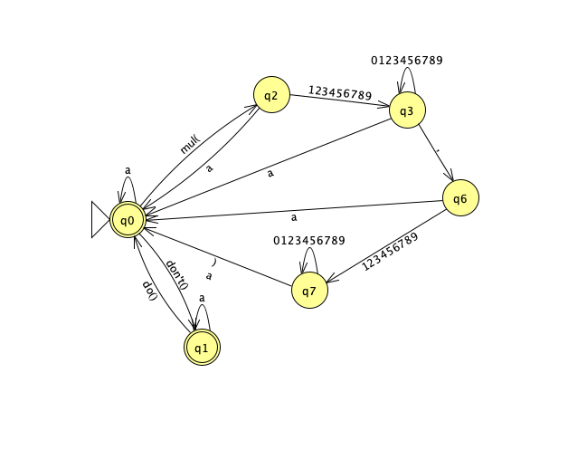
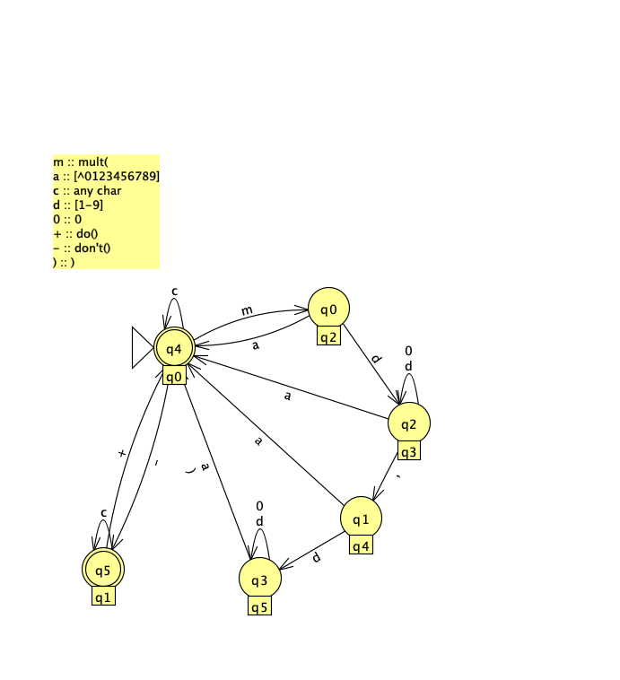
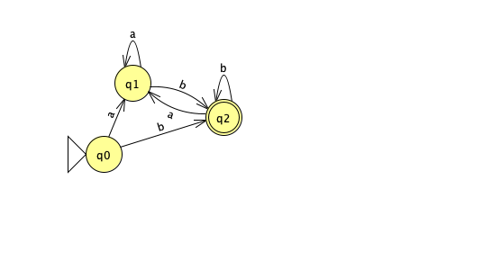
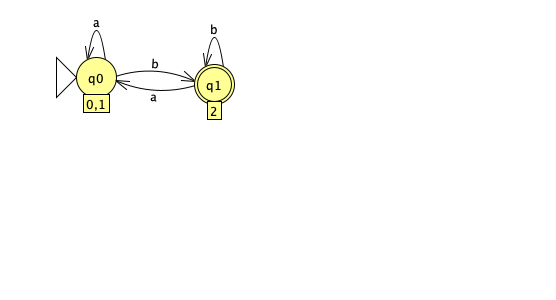

# AoC Day 3

## Regular Expressions and Finite Automata

We're dealing with a simple state machine today.
State machines can be modeled as [Deterministic Finite Automaton](https://en.wikipedia.org/wiki/Deterministic_finite_automaton)'s (DFA).

And this is exactly what we're going to to today!
To be more precise: We are going to define a [Mealy Machine](https://en.wikipedia.org/wiki/Mealy_machine)
  that will transition between several states and handle input depending on the state its in.

One possible DFA could look like this:



Here `a` means `everything other char that does not already have a transition`.

We can make it more clear and friendly for the tool I am using:



Ignore the numbers in the circles, we will use the labels in the rectangles beneath.

This DFA is already minimal.
Modelling each of the input tokens seperately would yield a very huge DFA,
  hence we use a simpler version.

You can read this diagram as follows:

- Each circle is a state our machine can be in
- Each arrow outgoing is a *transition*
  + These transitions take in a character and the current state and produce a new state

Usually you would need to write all characters down seperately.
  This however would also  mean that we would need to introduce more states
  as the transition from `q0` to `q2` would not be possible via `mul(`,
  but via `m` then `u` then `l` then `(`.
The same principle extends to `do()` and `don't()`:

- From `q0` to `q1`: `d` $\rightarrow$ `o` $\rightarrow$ `n` $\rightarrow$ `'` $\rightarrow$ `t` $\rightarrow$ `(` $\rightarrow$ `)`

But now we would also need to tell the DFA that it should go from any 
  of these intermediate states back to `q0` if any other char is encountered.
We will later use a more general from of this transition function, that 
  -- instead of taking in a character -- takes in a string and matches the prefix of that string.

### A simple example

Lets imagine we have this DFA.
  This DFA has an initial state (in which our automata will be when we first turn it on) 
    called `q0`.
  It also has one final state (we could have many final states) called `q2`.



Remember that the transition function `δ` would go from one state and a character to a new state.
  For `q0` this would mean that `δ(q0, a) = q1`.
  Meaning that if we're in `q0` and get an `a` as input, we would end up in `q1`.

Using the same principle we would define

- `δ(q0, b) = q2`
- `δ(q1, a) = q1`
- `δ(q1, b) = q2`
- `δ(q2, a) = q1`
- `δ(q2, b) = q2`

Each DFA has one minimal (as in, minimal amount of states) äquivalent DFA.
  For this automata it is this one:



"Äquivalent" here means, both automata "understand" the same inputs.
We say a DFA "understands" some input = `abc...` if `δ(δ(δ(... , ...), b),a) ∈ FinalStates`.

In other words: If we go along the whole input and use our transition function `δ`, 
    and our last state we end up in is one of the final states, then we accept the input.
  Our DFA would for example understand `aaab`, but not `a`.

This sounds similar? Yes this is how [Regular Expressoins](https://en.wikipedia.org/wiki/Regular_expression) work.
In fact, a DFA is exactly equivalent to one [Regular Expressoins](https://en.wikipedia.org/wiki/Regular_expression).

Our DFA is equivalent to: `(b|aa*b)(b|aa*b)*`.

As a side note: I did not try to implement the DFA we'll use to solve this problem
    in a way that it would accept `mult(\d+,\d+)|don't()|do()` in any way.
  This is not what we're gonna use it for. 

## Implementation in Haskell  

The alphabet is defined as follows:

```haskell
-- Technically only one of :n>^[%760@]&4$l5ym o!\n<#?,~p)}srah/(e2{1u+-8'w39*tcid;fb
type Σ = Char
type Σ' = String -- Σ*
```

The states of the automaton are enumerated as `Q0` to `Q5`.

```haskell
data Q
  = Q0 -- ^ do() (initial)
  | Q1 -- ^ don't()
  | Q2 -- ^ mult(
  | Q3 -- ^ [1-9] (after 'mult(') ) (NOTE: this is technically not correct; only {1,3} chars are allowed)
  | Q4 -- ^ [0-9] (after 'Q3')
  | Q5 -- ^ [1--9] (after 'Q4')
  deriving (Eq, Ord, Show)
```

The initial state is defined as `q0`.

```haskell
q0 :: Q
q0 = Q0
```

We can naively define our transition function like this:

```haskell
δ :: Q × Σ → Q
δ q c = undefined {- impossible ! -}
```

With the current implementation, achieving this behavior is not possible.
We would have to determine whether to stay or move based on whether we encounter
  `do()` or `d<something else>`, but this cannot be handled with just a single
  character.

To resolve this, we will define a new function, `δ'`,
  which takes a string as input, much like `δ*` does for DFAs.

There is just one problem:
  We need to return what we just read or the new string.
  Otherwise, we will not be able to continue processing later. 

We have two options here:
1. Implement this over the `State` Monad and keep all the knowledge hidden.
2. Return a tuple `Q × Σ'` where `Σ'` is the rest of the string.

The function `δ'` is an extension of `δ` to process strings.

```haskell
δ' :: Q × Σ' → Q
δ' q str@(c:rest) = case (q, c) of
  (Q0, _) | "mul("    `isPrefixOf` str -> Q2 -- try to read mul
  (Q0, _) | "don't()" `isPrefixOf` str -> Q1 -- dont read anymore
  (Q1, _) | "do()"    `isPrefixOf` str -> Q0 -- read again
  (Q0, c)                              -> Q0
  (Q1, c)                              -> Q1
  (Q2, c) | isDigit c && c /= '0'      -> Q3 -- here we lose the info about c
  (Q2, _)                              -> error "Not valid" -- We should go back to Q0
  (Q3, ',')                            -> Q4 -- num finished, next num (we lose all info about the number)
  (Q3, c) | isDigit c                  -> Q3 -- we stay, but lose information here
  (Q3, _)                              -> error "Not in input" -- We should go back to Q0
  (Q4, c) | isDigit c && c /= '0'      -> Q5 -- see above Q2 -> Q3
  (Q4, _)                              -> error "Not valid" -- We should go back to Q0
  (Q5, c) | isDigit c                  -> Q5 -- we stay, but lose information
  (Q5, ')')                            -> Q0 -- losing information (about both of our numbers)
  (Q5, _)                              -> Q0 -- losing information again
```

To combat the issues of losing information, we define a new transition function `δ''` with an extended alphabet.

We also define a new kind of alphabet, which we will be returning from `δ''`.

```haskell
type R = (Σ', Maybe Σ)

δ'' :: Q × Σ' → (Q, R)
δ'' q str@(c:rest) = case (q, c) of
  (Q0, _) | "mul("    `isPrefixOf` str -> (Q2, withoutPrefix "mul(")
  (Q0, _) | "don't()" `isPrefixOf` str -> (Q1, withoutPrefix "don't()")
  (Q1, _) | "do()"    `isPrefixOf` str -> (Q0, withoutPrefix "do()")
  (Q0, c)                              -> (Q0, nothing)
  (Q1, c)                              -> (Q1, nothing)
  (Q2, c) | isDigit c && c /= '0'      -> (Q3, just c)
  (Q2, _)                              -> (Q0, nothing)
  (Q3, ',')                            -> (Q4, nothing)
  (Q3, c) | isDigit c                  -> (Q3, just c)
  (Q3, _)                              -> (Q0, nothing)
  (Q4, c) | isDigit c && c /= '0'      -> (Q5, just c)
  (Q4, _)                              -> (Q0, nothing)
  (Q5, c) | isDigit c                  -> (Q5, just c)
  (Q5, ')')                            -> (Q0, just c) -- we need to indicate that we did meet ')'
  (Q5, c)                              -> (Q0, nothing)
  where
    withoutPrefix pref = (fromJust $ pref `stripPrefix` str, Nothing)
    just c = (rest, Just c)
    nothing = (rest, Nothing)
```

For testing purposes, we use the following string.

```haskell
testString :: Σ'
testString = "sldfjsfdmul(12,343)sldfjsddon't()sldfjmul(234,3)fsldjdo()sd081234234nsdfjlsj012mul(4332,34lnäaKSD#A+WER09834fmul(2,3)"
--                    ^^^^^^^^^^^       ^^^^^^^     ^^^^^^^^^      ^^^^                      !!!!!!!!!!!                   ^^^^^^^^
```

We then define `test` to apply `δ''` iteratively.

```haskell
test :: Σ' -> [(Q, Maybe Σ)]
test s =
  let loop q r = case r of
            []  -> []
            str -> let t@(q', (str', c)) = δ'' q str in (q', c) : loop q' str'
  in loop q0 s
```

If we run this now, we will obtain a list of R values. This represents tuples consisting of new states and the corresponding returned characters.

```hs
-- test testString

result = 
 [(Q0,Nothing),(Q0,Nothing),(Q0,Nothing),
  (Q0,Nothing),(Q0,Nothing),(Q0,Nothing),
  (Q0,Nothing),(Q0,Nothing),(Q2,Nothing),
  (Q3,Just '1'),(Q3,Just '2'),(Q4,Nothing),
  (Q5,Just '3'),(Q5,Just '4'),(Q5,Just '3'),
  (Q0,Just ')'),(Q0,Nothing),

  {-
    snip many many Nothing's
  -}

  (Q3,Just '4'),(Q3,Just '3'),(Q3,Just '3'),
  (Q3,Just '2'),(Q4,Nothing),(Q5,Just '3'),

  -- Look: We're not getting a Just '(', because it was followed by an 'l' 
  -- and is not valid
  (Q5,Just '4'),(Q0,Nothing),(Q0,Nothing),

  (Q0,Nothing),(Q0,Nothing),(Q0,Nothing),
  (Q0,Nothing),(Q0,Nothing),(Q0,Nothing),
  (Q0,Nothing),(Q0,Nothing),(Q0,Nothing),
  (Q0,Nothing),(Q0,Nothing),(Q0,Nothing),
  (Q0,Nothing),(Q0,Nothing),(Q0,Nothing),
  (Q0,Nothing),(Q0,Nothing),(Q2,Nothing),
  (Q3,Just '2'),(Q4,Nothing),(Q5,Just '3'),
  (Q0,Just ')')]
```

Instead of simply iterating through the list and parsing the numbers, we’ll take a
  different approach.
We’ll immediately discard all `Nothing` values and introduce a `Memory` to keep track
  of both the final sum and the intermediate values.

This `Memory` is necessary because finite automata can only remember their most recent
  state.
This limitation is also why languages like $\{ a^n b^n \mid n \in \mathbb{N} \}$ are
  not regular -- there’s no way to ensure we encounter as many `b`s as `a`s, as finite
  automata cannot retain the value of `n`.


```haskell
data Memory
  = Memory
      { _sum  :: Sum Int
      , q3num :: Σ'
      , q5num :: Σ'
      }
  deriving (Show)

initialMemory :: Memory
initialMemory = Memory {_sum = 0, q3num = [], q5num = []}
```

The `addNumbers` function computes the product of numbers read in states `Q3` and `Q5`.

```haskell
addNumbers :: Memory -> Memory
addNumber = {- snip -}
```

The final solution processes the input string using the automaton and updates the memory.

```haskell
solve :: Q × Memory × Σ' → Memory
solve q memory []    = memory
solve q memory input =
  let (q', (rest, char)) = δ'' q input in
  let newMemory = case q' of
        Q3 | Just c <- char -> memory {q3num = memory.q3num <> [c]}
        Q5 | Just c <- char -> memory {q5num = memory.q5num <> [c]}
        Q0 | Just c <- char ->
          if not (null memory.q3num) && not (null memory.q5num)
            then addNumbers memory
            else memory {q3num = [], q5num = []}
        Q0 | Nothing <- char -> memory {q3num = [], q5num = []}
        _ -> memory
  in solve q' newMemory rest
```

Finally, the `main` function reads input and computes the result.

```haskell
main :: IO ()
main = do
  content <- readFile "input/day03.txt"
  let res = solve q0 initialMemory content
  print res._sum
```

We defined a [Mealy Machine](https://en.wikipedia.org/wiki/Mealy_machine) with the following components:

- **Transition Function**: $$\delta'' : Q \times \Sigma' \to (Q, R)$$  
- **Start State**: $$q_0$$  
- **Input Alphabet**: $$\Sigma = \text{Char}$$  
- **Output Alphabet**: $$R = (\Sigma', \text{Maybe } \Sigma)$$

Because we also needed to remember some information along the way
we defined `Memory`.

There are several alternative approaches to achieve the same result using similar techniques:  
- For instance, instead of using `Memory`, we could fold or reduce over the `List` produced by the `test` function defined above.  
- We could leverage the `Control.Monad.State` monad to manage all stateful computations in a more elegant and structured way.  
- Alternatively, we could define δ'' in terms of `Q × Σ' -> (Q, R)` by introducing additional states.
  For example, `d` and `o` could each have their own state, with `o` transitioning to `q0` unless followed by `n`.
  However, this would unnecessarily complicate the definition of δ''.  

